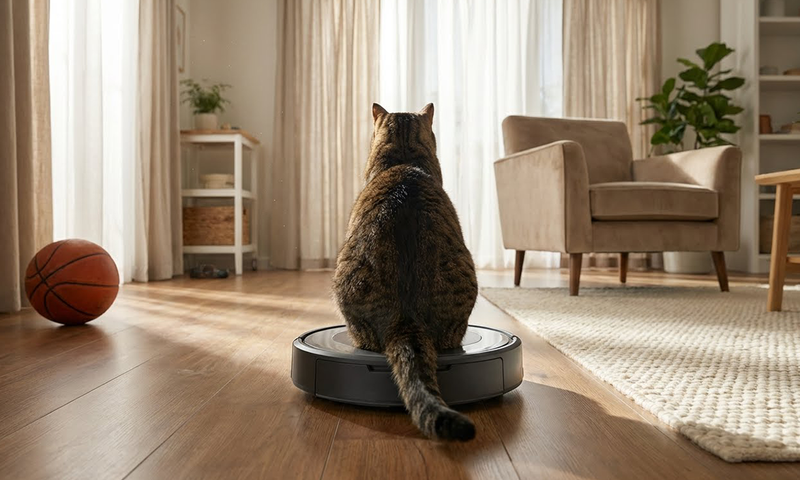
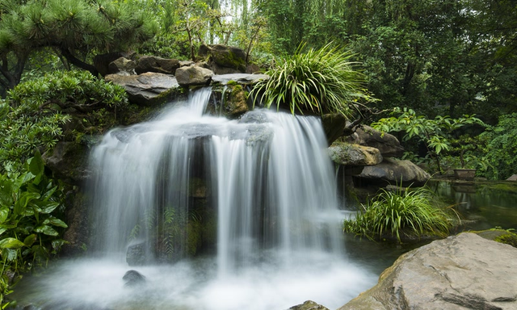
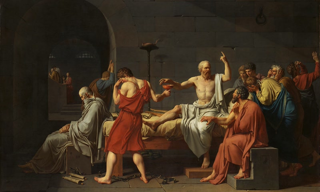

# Camera and prompt guide

Examples are organized under [`test/`](./). Each example includes `prompt.txt`,
`camera.npy`, and `actions.txt`, with an additional `image.png` for I2V.
All examples use the shared `test/negative_prompt.txt` by default.
Run the commands below from the repository root.

## Inference examples

Replace `path/to/` with your input paths. Both modes support `--model-type base`
or `--model-type fast`.

### Image-to-video

```bash
python inference.py --model-type fast --mode i2v \
  --image-path path/to/image.png \
  --prompt-path path/to/prompt.txt \
  --camera-path path/to/camera.npy
```

### Text-to-video

```bash
python inference.py --model-type fast --mode t2v \
  --prompt-path path/to/prompt.txt \
  --actions-file path/to/actions.txt
```

### Parameters

| Parameter | Description |
| --- | --- |
| `--model-type` | Select `base` or `fast`. |
| `--mode` | Select `i2v` or `t2v`. |
| `--image-path` | Starting image for I2V; omit for T2V. |
| `--prompt-path` | Read the prompt from a text file. Use `--prompt "..."` to pass text directly instead. |
| `--camera-path` | Load a global c2w trajectory from a `.npy` file. |
| `--actions-file` | Generate the trajectory from an action text file. Use `--actions "forward1 yaw_left30"` to pass actions directly instead. |
| `--num-chunks` | Generate only the first N chunks; otherwise use the full trajectory. Each chunk contains 33 frames. |
| `--seed` | Random seed; defaults to `42`. |
| `--output-path` | Output video path. By default, each run creates a directory under `output/<model-type>/<mode>/`. |
| `--enable-compile` | Enable compilation; disabled by default. |

Choose exactly one trajectory input: `--camera-path`, `--actions-file`, or
`--actions`. All three are available in both modes. Negative prompts default to
`test/negative_prompt.txt`; override with `--negative-prompt-path` when needed.
Negative prompts affect Base with CFG enabled; Fast uses CFG=1 and does not use
them for sampling.

## Camera inputs

Define camera motion with actions, or load an existing camera-to-world (c2w)
trajectory. Both options work with I2V and T2V and use 33 frames per chunk.

### Define a trajectory with actions

An action consists of a movement name and a value, optionally followed by `xN`
to repeat it N times. Translation values specify distance in the model's
coordinate scale; rotation values specify degrees. Each action produces one
chunk before repetition. Separate actions with spaces, commas, or newlines;
use `#` for comments.

| Movement | Actions | Short forms |
| --- | --- | --- |
| Forward / backward | `forward1`, `backward1` | `f1`, `b1` |
| Left / right | `left1`, `right1` | `l1`, `r1` |
| Up / down | `up1`, `down1` | Same |
| Turn left / right | `yaw_left30`, `yaw_right30` | `yl30`, `yr30` |
| Look up / down | `pitch_up15`, `pitch_down15` | `pu15`, `pd15` |
| Orbit with a left / right turn | `orbit_left15`, `orbit_right15` | Same |
| Orbit with an upward / downward turn | `orbit_up15`, `orbit_down15` | Same |
| Repeat over N chunks | `forward1xN` | `f1xN` |
| Combine within one chunk | `forward2&right2&yaw_left45` | `f2&r2&yl45` |
| Retrace the preceding N chunks | `reverseN` | Same |

The values above are examples and can be changed. For example, an `actions.txt`
file can contain:

```text
forward1x2
backward1
left1
right1
up1
down1
yaw_left30
yaw_right30
pitch_up15
pitch_down15
orbit_left15
orbit_right15
orbit_up15
orbit_down15
forward2&right2&yaw_left45
reverse2
```

Pass this sequence with `--actions-file path/to/actions.txt`, or use `--actions`
with the actions separated by spaces. Use `--num-chunks N` to generate only the
first N chunks.

Orbit keeps the camera aimed at a point along its current forward direction.
Set the distance to this point with `--orbit-radius 2` (the default is 2), or
put `@orbit_radius 2` at the beginning of the action file. The command-line
value takes precedence. A radius of 0 produces an in-place yaw or pitch turn.
Directions describe the viewing turn: `orbit_left15` turns left while moving
the camera right around the center. Consecutive orbit actions preserve the
center; a translation, in-place turn, or radius change establishes a new one.
Orbit actions occupy separate chunks and support repetition and reversal.
Keep the arc length per chunk, `radius × angle × π / 180`, at most 5.

#### Coordinates and motion

Generated trajectories start at the origin, facing +Z, with +X to the right and
+Y down. Forward/backward and left/right follow the camera's heading on the
horizontal plane, while up/down follows the world vertical axis. Yaw turns the
camera in place, and pitch changes its viewing elevation. Combined translations
follow the heading at the chunk's start, with a maximum translation magnitude
of 5 per chunk. Both the UCPE module and the RepEncoder module derive their
camera representations from the same global c2w trajectory: the UCPE module
uses chunk-relative poses at metric scale, while the RepEncoder module
normalizes translations by a scene scale computed from the selected source views.

### Export or load camera poses

Inference converts actions to c2w poses automatically. To export a trajectory
without loading a model, run:

```bash
python tools/build_trajectory.py \
  --actions-file path/to/actions.txt \
  --output-dir output/trajectory
```

Use the resulting file with `--camera-path output/trajectory/camera.npy` in place
of `--actions-file` or `--actions`.

You can also supply your own `.npy` file containing global c2w matrices with
shape `[T, 3, 4]` or `[T, 4, 4]`. Use the same right/down/forward convention,
with one pose per frame and 33 frames per chunk. Follow the coordinate and
scale conventions described above.

## Prompt styles

### Third-person following views



For a moving subject that should stay in view, begin with
**“A third-person ... view closely follows ...”** to encourage subject following.
Describe the subject's appearance, its movement, and its surroundings.
For example, the [Cat prompt](I2V/00_cat_vac/prompt.txt) starts:

> A third-person gameplay-like camera closely follows a gray robot vacuum moving through a modern interior with reflective hardwood floors and beautiful rays of light.

The rest of the prompt describes the cat, the furniture, and how the cat balances
on the moving vacuum.

### First-person views



For first-person views, describe the setting, spatial layout, materials,
lighting, and relationships between objects. For example, the
[Waterfall prompt](I2V/06_waterfall/prompt.txt) starts:

> A broad garden waterfall pours over layered dark rocks into a shallow pool surrounded by dense subtropical plants.

It then describes the rock formations, surrounding foliage, and pool boundaries
to establish the scene's structure.



The [Socrates prompt](I2V/01_socrates/prompt.txt) starts:

> A scene of static, painted sculptures depicts a solemn stone prison chamber, with classical figures neatly arranged around a low wooden bed.

It describes the figures as painted sculptures, then details their poses,
clothing, props, and arrangement within the chamber.

### Length and consistency

Use one focused English paragraph. Around **80–120 words** is a useful starting
point; dynamic subject-following prompts often need **100–130 words** to cover
both motion and environment. These are writing guidelines, not input limits.

For I2V, keep the description consistent with the input image. For T2V, describe
the subject and setting explicitly because there is no starting image. Keep
appearance and lighting consistent throughout the paragraph, and avoid cuts,
shot changes, or camera directions that compete with the supplied trajectory.
The bundled prompts preserve the wording used for their original examples.
